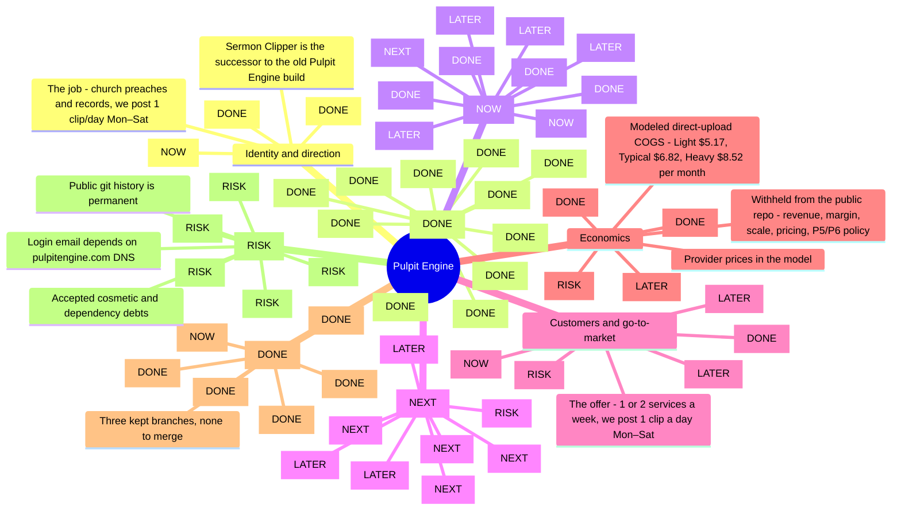

# Pulpit Engine business mind map

Version 1. As of 2026-09-11. Source of truth: the sermon-clipper repository only (README.md, docs/, DECISIONS.md, git history). Head 1d77d39 (PR #105, 2026-09-09). Production b510960 verified at /api/health on 2026-09-08.

Status tags: DONE is merged and deployed. NOW is where the business stands this week. NEXT is the immediate by-hand or planning step. LATER is planned but not started. RISK is a recorded open problem.

## Where we are, in one paragraph

Sermon Clipper, the successor build of Pulpit Engine, has its full publishing spine built and deployed: intake, Scribe v2 transcription, two-stage Claude analysis, a trim-only editor, one-pass QC'd export, weekday scheduling, an append-only human review queue, and a fail-closed Facebook publisher. Phases P0 through P3 of the agentic-editor plan are merged and browser-verified in production as of 2026-09-08. Three production switches are still off: automatic publishing, schedule arming, and retention deletion. The 30-day human-only review clock has not started. By decision on 2026-09-05 there is no paying customer until automatic publishing works, and the 2026-10-16 launch date was dropped. The immediate path is: fix the transcription primary failure seen on 2026-09-08, run the Tier 3 sandbox publish by hand, flip the publishing switch, start the 30-day clock, then write the measured P4 to P8 plan.

## Mind map (Mermaid)

## Outline with notes and citations

### Identity and direction

What the business is and the decisions that fix its course.

- **The job: church preaches and records, we post 1 clip/day Mon–Sat**
  The church keeps doing what it already does. The system pulls the sermon, finds the strongest moments, cuts vertical captioned clips, ranks them, and posts one per day to the church's Facebook Page. Never on Sunday. One service/week yields 6 clips; two services yield 3 + 3.
  Source: docs/BUSINESS_OVERVIEW.md
- **Editorial standard: select what the pastor said, never rewrite it** [DONE]
  Frozen 2026-08-11. Every delivered clip is one continuous range of the source. Allowed edits: start, end, crop, captions, title, hook. Forbidden: any deletion inside the range, including filler words and pauses. Enforced at the render boundary, not only in the editor. Faithfulness outranks polish.
  Source: docs/PULPIT_ENGINE_EDITORIAL_STANDARD.md
- **Sermon Clipper is the successor to the old Pulpit Engine build**
  The old build (GCP project euphoric-patrol-493623-b8, pulpitengine.com, the pulpit-engine Dropbox workspace) will be retired. Infra keeps the sermon-clipper name until one atomic, planned cutover: domain, email domain, Railway, GCP display name, repo, Stripe, marketing. Email already sends from send.pulpitengine.com. The dashboard domain is intended to be app.pulpitengine.com.
  Source: DECISIONS.md 2026-07-18, three entries on the successor, email subdomain, and email split
- **Governing decision: build the whole plan in order, no customer until publishing works** [NOW]
  Chosen 2026-09-05. Declined: selling the editor alone, a one-church pilot after P1.12, and the 2026-10-16 live date. The 90-day goal from 2026-07-18 no longer binds. Accepted cost: the publishing spine is months of work and earns nothing until it lands.
  Source: DECISIONS.md 2026-09-05 'Build The Whole Plan In Order; No Customer Until Publishing Works'
- **Reuse Pulpit Engine's Meta App and Business Manager for posting** [DONE]
  No new Meta app review. A church's Page is granted to the Business Manager System User once, by hand, exactly as the old Pulpit Engine onboarded pages. META_SYSTEM_USER_TOKEN lives only on the worker.
  Source: DECISIONS.md 2026-07-19 'Tier 3 Facebook Auto-Posting Will Reuse Pulpit Engine's Meta App'

### Product as it exists today [DONE]

Everything here is merged to main and running in production at b510960 plus PR #105. Flags that gate live behavior are listed under Infrastructure.

- **Ingest: direct upload, YouTube URL, channel auto-import** [DONE]
  Direct browser upload to Cloudflare R2 is the approved intake path (passed the P0 cost gate). YouTube URL import works through yt-dlp and a residential proxy but its economics failed the gate. A YouTube channel poller turns new public uploads into projects, no backfill, with a rolling 24h daily cap. Project creation freezes candidate limit, clip count, timezone, service days and occurrence into processingConfig.
  Source: DECISIONS.md 2026-07-18 URL import; 2026-08-12 settings freeze; docs/AUTO_IMPORT_LOOP.md
- **Pipeline: FINALIZE → PROBE → TRANSCRIBE → ANALYZE → export → CLEANUP** [DONE]
  DB-polling job queue with heartbeats and stale-job recovery, no Redis. A separate compiled worker (Dockerfile.worker) carries ffmpeg, ffprobe, and whisper.cpp. Exports run on their own export_jobs queue in the same worker process.
  Source: README.md; DECISIONS.md 2026-07-06 queue and worker entries
- **Transcription: ElevenLabs Scribe v2 primary, whisper.cpp fallback** [DONE]
  Provider is explicit env policy (TRANSCRIPTION_PRIMARY_PROVIDER / FALLBACK), never key detection. A fallback to whisper.cpp opens a transcription_provider_fallback hold that blocks publishing for that service. PR #105 (2026-09-09) shows open fallback holds to platform operators in a banner on the review queue.
  Source: DECISIONS.md 2026-08-16 and 2026-08-19; docs/OPERATOR_TRANSCRIPTION_ALERTS.md
- **Analysis: Haiku 4.5 Stage A → Sonnet 5 Stage B, 18-candidate ceiling** [DONE]
  500 candidate windows cover the whole sermon, thinned by IoU, Stage A classification streams under a 32,000-token ceiling, Stage B scores up to 25. Master default and hard max is 18 candidates; a hidden staff-only override can lower it. Production fails closed without Claude; ANALYSIS_ALLOW_HEURISTIC is the only visible override. Model routing is a versioned per-stage policy copied into each project.
  Source: DECISIONS.md 2026-08-11 catch-up records; 2026-08-12 fail-closed; 2026-08-13 model routing
- **Editor: trim-only timeline, canvas captions, Clean and Highlighter presets** [DONE]
  Editor delta plan Slices 1–13 closed 2026-09-05 (PRs #43–#72). One timeline surface with Title, Video and Audio rows, drag-to-trim handles, captions positioned by dragging on the canvas, a title overlay drawn as shapes, real audio peaks. Word deletion is gone: transcript edits change text only, and export refuses non-continuous ranges.
  Source: docs/EDITOR_DELTA_PLAN_2026-08-18.md; DECISIONS.md 2026-08-20 through 2026-09-04
- **Export: one ffmpeg pass, 1080×1920, libass burn-in, seven-check QC** [DONE]
  An export is identified by clip + edit version only. One pass does seek, crop, scale-to-fill, caption burn-in, loudnorm and x264/AAC. Before upload it must pass decode, dimensions, audio stream, duration, non-empty, checksum and caption-event checks. SUCCEEDED means QC passed. Fonts are the bundled DejaVu faces; the Inter question was settled by rendering inside the worker image.
  Source: DECISIONS.md 2026-09-02 export identity and QC; 2026-09-05 one-pass and font entries
- **Scheduling: weekday slots from the calendar, never Sunday** [DONE]
  posting-schedule.ts starts the day after the service, skips every Sunday, and takes the next N days (6, or 3 per service). A past date is MISSED and ranks never shift up. A day with no clip is armed anyway as UNFILLED with an exception. Arming runs behind AUTOMATIC_SCHEDULE_ARMING_ENABLED, still false.
  Source: DECISIONS.md 2026-09-05 'Posting Days Come From The Calendar' and 'A Slot With No Clip Is Armed Anyway'
- **Human review: append-only decisions, exact-render queue, atomic REPLACE** [DONE]
  clip_reviews and clip_review_feedback are append-only by database trigger. Decisions are ACCEPT, REVISE, REPLACE with unlimited feedback items in seven categories. /app/operator/review shows every scheduled slot across every church, soonest first, playing the exact file. Delivery needs four identity facts to match: clip, edit version, the slot's bound export, and the QC checksum. REPLACE is one transaction locked on the project row. Operators can fill a shortage from a prior service and reschedule a missed slot, both by explicit action only.
  Source: DECISIONS.md 2026-09-05 and 2026-09-06 review entries; P2 and P3 in docs/AGENTIC_EDITOR_PROGRESS.md
- **Publishing: one eligibility module, intent before the Meta call** [DONE]
  src/lib/delivery/eligibility.ts is the only authority on whether anything reaches an audience. AUTOMATIC_PUBLISHING_ENABLED must equal the string true. The old latest-successful-export lookup is gone; only ScheduledPost.exportJobId can publish. A PublishAttempt row is written before the Graph API call and an indeterminate outcome blocks rather than retries. A missed post is terminal for automation. One real sandbox publish is proven (post 999309073105794, 2026-07-24).
  Source: DECISIONS.md 2026-09-05 'One Module Decides' and 'Intent Is Recorded Before A Publish'; docs/TIER3_SANDBOX_TEST_CHECKLIST.md
- **Accounts and billing: email OTP, workspace roles, Trial / Paid** [DONE]
  Email OTP sign-in through Resend, DB-backed sessions, roles (owner, admin, editor, approver, viewer), tokenized invitations. Trial is 30 days with no card and identical features; on expiry the workspace goes read-only. Paid is one Stripe price (STRIPE_PRICE_PAID) with no published usage limit during the pilot. A workspace that ever paid never returns to trial. Platform staff is not a workspace role; the operator marker is granted only at a shell.
  Source: DECISIONS.md 2026-08-13 'Replace Free, Starter, and Pro'; 2026-08-14 paidAt; 2026-09-05 operator entries
- **Operations: health, operational events, cost telemetry, report-only retention** [DONE]
  /api/health reports readiness, migrations, worker heartbeat and commit SHA. Workspace-scoped operational events cover uploads, billing, processing, approvals, exports, publishing and stale-worker recovery. Versioned COGS facts record what each stage cost, separate from customer entitlements. The retention reaper emits report-only until SOURCE_RETENTION_DELETION_ENABLED is proven.
  Source: DECISIONS.md 2026-07-07 observability; 2026-08-12 COGS facts; 2026-09-05 retention

### Build program P0 → P8 [NOW]

The agentic-editor implementation plan is the roadmap. Progress is tracked in docs/AGENTIC_EDITOR_PROGRESS.md. P0 through P3 are built and deployed. P4 through P8 are direction, not yet a frozen commit list.
Source: docs/AGENTIC_EDITOR_IMPLEMENTATION_PLAN.md; docs/AGENTIC_EDITOR_PROGRESS.md

- **P0 Cost truth and current defects (done 2026-08-14)** [DONE]
  21 commits, merged as PR #34. Benchmark corpus contract, candidate limits, hidden church override, heuristic guard, typed COGS events, byte metering, publisher kill switch, migration Wave 1, daily cost rollups, the Gate A cost report, and the plan-grid audit that killed Free/Starter/Pro.
  Source: AGENTIC_EDITOR_IMPLEMENTATION_PLAN.md §9
- **P1 Correctness substrate (done 2026-09-05)** [DONE]
  12 commits: render a pinned edit version, export identity, mandatory QC, no internal word cuts, one continuous range, stable caption identity, reanalysis blocked once durable work exists, weekday posting schedule, slot arming and retention flags, service date and occurrence capture, delivery eligibility module, hardened publish claims.
  Source: AGENTIC_EDITOR_PROGRESS.md 'Where the build stands'
- **P2 Human review substrate (done 2026-09-06)** [DONE]
  9 commits: migration Wave 2, platform-operator authorization, append-only review services, render only scheduled clips, the exact-render operator queue, accept/revise/feedback UI, atomic replacement, exact acceptance required for delivery, and the explicit 30-day program start with its sandbox-proof script.
  Source: AGENTIC_EDITOR_PROGRESS.md; docs/HUMAN_REVIEW_30_DAY_RUNBOOK.md
- **P3 Candidate and operator experience (done 2026-09-06, browser-verified 2026-09-08)** [DONE]
  9 commits: role-safe candidate pool read model, complete pool shown to churches with selector internals hidden, cross-workspace operator project view, cheap on-demand source previews, prior-service fill policy and action, missed-slot reschedule, and the disabled three-services option. Exit review proved 11 of 12 criteria from code; the operator-marker criterion passed in production on 2026-09-08 after the grant.
  Source: docs/P3_EXIT_MANUAL_TEST.md; AGENTIC_EDITOR_PROGRESS.md 'P3 exit review'
- **YOU ARE HERE: publishing go-live and the 30-day clock** [NOW]
  P3 is closed. Automatic publishing and schedule arming are still off in production and the 30-day human-only review phase has not started. The next real milestone is the by-hand Tier 3 sandbox test, the switch flip, and the program start. See the Next actions branch.
  Source: docs/P3_EXIT_MANUAL_TEST.md status; DECISIONS.md 2026-09-05
- **P4 Derivative-first sermon understanding and Media Region Index** [NEXT]
  Build one cheap representation of the whole service: 480p proxy, mono FLAC, scene and silence facts, sparse frames, hashes, forbidden regions (worship, announcements, prayer, baptism, altar call, slides). Pass A picks one sermon corridor locally before paid Scribe; Pass B classifies precisely after. Final renders read candidate-range media, not the full service. Requires migration Wave 3 and a measured commit-by-commit update approved first.
  Source: AGENTIC_EDITOR_IMPLEMENTATION_PLAN.md §13
- **P5 Selector policy in shadow mode (proprietary; repo goes private)** [LATER]
  The transcript-first Selector that must beat the measured baseline: today all six clips of a 50-minute sermon fall between 1:25 and 10:58 because Stage A classification discards the rest. Design is withheld from the public repo. Trigger: buy GitHub Pro, flip the repo private, re-verify the four required checks before the first P5 commit. Prototype starting point is the kept branch feat/semantic-outline-pipeline.
  Source: DECISIONS.md 2026-08-11 'Repository Stays Public Until P5'; AGENTIC_EDITOR_PROGRESS.md kept branches
- **P6 Deterministic final-render QC and the Review Agent (withheld)** [LATER]
  The agent that reviews the exact final render with contact sheets and metadata, proposes revise or replace, and never influences a human decision until the evidence gates say so. Roughly $0.35 per church-month.
  Source: AGENTIC_EDITOR_IMPLEMENTATION_PLAN.md §14–15, withheld
- **P7 Fixed 30/30/30 program and evidence-gated autonomy** [LATER]
  Modes: HUMAN_REFERENCE (30 full days, Jake alone) → BLIND_SHADOW (≥30 days, ≥150 blind comparisons, zero critical false accepts) → AGENT_FIRST_HELD (≥30 days, ≥300 audited decisions, override ≤5%) → AUTONOMOUS only by explicit promotion. KILL_SWITCHED restores human hold at once. Every new church gets human review of its first four services.
  Source: AGENTIC_EDITOR_IMPLEMENTATION_PLAN.md §16
- **P8 General learning from Jake's review data** [LATER]
  One general editing policy, no per-church profiles. ACCEPT is a positive example for the exact checksum, REVISE an edit delta, REPLACE a preference pair only after the replacement is accepted. Improve in order: safety rules, boundaries, prompts, small classifiers, and fine-tuning last.
  Source: AGENTIC_EDITOR_IMPLEMENTATION_PLAN.md §17

### Next actions (the gate to revenue) [NEXT]

In order. Nothing below is owned by a merged commit yet; each is a by-hand or planning step that unlocks the next phase.

- **1. Investigate the Scribe primary failure seen 2026-09-08** [RISK]
  The P3 demo service transcribed with whisper_cpp after the primary provider fell back. The operator page raised TRANSCRIPTION PROVIDER FALLBACK. Find the cause and check caption accuracy before any publishing test; a fallback hold blocks delivery.
  Source: AGENTIC_EDITOR_PROGRESS.md 'P3 production browser results', follow-up
- **2. Run the Tier 3 sandbox test by hand** [NEXT]
  Against First Baptist Sandbox Page 1128280933691493. Keep the global switch off; create one manual pinned render for one scheduled slot; record an exact human ACCEPT; run npm run program:sandbox-proof and require the census to be exactly that row; set AUTOMATIC_PUBLISHING_ENABLED=true; verify the Page post is the accepted file and nothing else published.
  Source: docs/HUMAN_REVIEW_30_DAY_RUNBOOK.md 'Before you start'; docs/TIER3_SANDBOX_TEST_CHECKLIST.md
- **3. Start the 30-day human-only program** [NEXT]
  npm run program:start. The clock starts at that moment, cannot be backdated, and never restarts. A pause extends it. Day 30 is not a handover; P7 shadow follows. Program start is refused until an exact accepted render, one REPLACE, and one real sandbox publish exist.
  Source: DECISIONS.md 2026-09-06 'The Thirty Days Are Fixed'
- **4. Turn on schedule arming, then prove retention deletion** [NEXT]
  Enable AUTOMATIC_SCHEDULE_ARMING_ENABLED after the allocator smoke test. Run at least one complete report-only retention cycle in production, read back the reported keys, then enable SOURCE_RETENTION_DELETION_ENABLED. Expect a first-enablement backlog: the coordinator recorded nothing while publishing was off.
  Source: AGENTIC_EDITOR_IMPLEMENTATION_PLAN.md §22 steps 12 and 19; docs/DEPLOYMENT.md
- **5. Write and approve the measured P4–P8 commit plan** [NEXT]
  Use P0 cost data and P2 review data to fix exact models, thresholds, budgets and the commit list before any P4 behavior is implemented. The plan is corrected in place, keeping trace links.
  Source: AGENTIC_EDITOR_IMPLEMENTATION_PLAN.md §13 planning status
- **6. Fix intake economics before YouTube import is offered** [LATER]
  The IPRoyal contract fails the $12 gate. Options: a better proxy contract, or implement PERC (currently zero implementation). Direct upload is the approved path meanwhile. Revisit trigger for the proxy decision: over $200/month proxy spend or over 25 churches.
  Source: DECISIONS.md 2026-08-13 IPRoyal; 2026-07-23 proxy ADR
- **7. Go private and buy GitHub Pro before the first P5 commit** [LATER]
  Reapply the saved branch-protection payload and prove all four checks are still required on one PR. Never restore public visibility afterward.
  Source: DECISIONS.md 2026-08-11
- **8. Take the first paying church** [LATER]
  Only after automatic publishing works and the human-only review is running. No date is committed; 2026-10-16 was explicitly dropped.
  Source: DECISIONS.md 2026-09-05

### Customers and go-to-market

One committed pilot church, zero paying customers by decision. Growth is opportunistic until the publishing spine is live.

- **Today: one committed church, zero paying, three production workspaces** [NOW]
  Workspaces in production: First Baptist Demo (Jake is OWNER, used for the P3 browser test), Jake's Church (the 49:41 reference service z4FCS3JcZPs), and Tier 3 Sandbox Test (Page ID retained, one real publish). Production held 9 projects on 2026-09-08.
  Source: docs/P3_EXIT_MANUAL_TEST.md; AGENTIC_EDITOR_IMPLEMENTATION_PLAN.md §6
- **The offer: 1 or 2 services a week, we post 1 clip a day Mon–Sat**
  Onboarding asks sermons per week (1 or 2) and service days. Church provides streaming access and Facebook Page admin. Trial 30 days with no card, then Paid. Three services per week is shown as coming later.
  Source: docs/BUSINESS_OVERVIEW.md; P3.9
- **Platform roadmap: Facebook Reels first, then Instagram, TikTok, YouTube Shorts** [LATER]
  The calendar's platform picker already lists Instagram, TikTok and YouTube but only Facebook is live. Text posts and infographic posts come in a later phase with a per-type daily breakdown.
  Source: docs/BUSINESS_OVERVIEW.md 'Future Phase'
- **Pilot math: one church gives about 26 decisions a month** [RISK]
  150 blind-shadow comparisons need about 5.8 months from one church; 300 audited agent-first decisions need about 11.5 months, sequentially. Do not shrink the gates to fit the calendar. Add churches when possible and extend the held phases honestly.
  Source: AGENTIC_EDITOR_IMPLEMENTATION_PLAN.md §6
- **Church experience rules already enforced** [DONE]
  Churches see the complete actual candidate pool, never the 18 ceiling, never selector scores or model versions. Church approval, when enabled, composes at publish time against the bound export. A brand template sets identity, caption defaults, colors and lower-third text.
  Source: P3.2; DECISIONS.md 2026-07-07 brand templates
- **After autonomy: every new church still starts with human review** [LATER]
  Human review for a new church's first four services and full audit of its first two autonomous weeks. At 100 churches or fewer, blind-audit 10% of autonomous clips. A complaint triggers a blinded audit of that church's trailing two weeks.
  Source: AGENTIC_EDITOR_IMPLEMENTATION_PLAN.md §16 'After autonomy'

### Economics

Cost truth is measured in production and gated in code. Revenue, margin, scale and price positioning are withheld from the public repository.

- **Cost gates enforced in code** [DONE]
  Core technical cost per service, excluding intake and payment: hard cap $1.50. Typical direct-upload variable COGS: $8 or less per month. Stable PERC: $10 or less. YouTube intake must prove $12 or less or cannot be the standard path. A paid stage with no known unit price blocks the gate.
  Source: AGENTIC_EDITOR_IMPLEMENTATION_PLAN.md §5.5
- **Measured: direct upload passed at $0.18 per service** [DONE]
  $0.182414 per service, $1.58 per typical church-month at 8.66 services. Gate A passed for direct upload on 2026-08-13.
  Source: DECISIONS.md 2026-08-13 'Direct Upload Passes the P0 Cost-Truth Gate'
- **Measured: YouTube proxy failed at $21–22 per month** [RISK]
  IPRoyal at 2 GB for $12.50 is $6.25 per GB. The 392,808,104-byte reference service costs $2.46 in proxy bytes alone, $21.26 per typical month before processing, against a $12 gate.
  Source: DECISIONS.md 2026-08-13 'The Current IPRoyal Contract Fails the YouTube Cost Gate'
- **Modeled direct-upload COGS: Light $5.17, Typical $6.82, Heavy $8.52 per month**
  Includes $2.10 of Stripe fees. Direct technical cost before Stripe is about $3.07 / $4.72 / $6.42, or roughly $0.55 per typical service. Largest lines: Scribe transcription ($2.26 typical), candidate selection ($0.52), Review Agent ($0.35).
  Source: AGENTIC_EDITOR_IMPLEMENTATION_PLAN.md §5.2
- **Provider prices in the model**
  ElevenLabs Scribe v2 $0.22 per audio hour. Claude Sonnet 5 $3 in / $15 out per million tokens, Batch API 50% off. Cloudflare R2 $0.015 per GB-month with free egress. Railway CPU, memory and egress. Stripe per-transaction plus Billing.
  Source: AGENTIC_EDITOR_IMPLEMENTATION_PLAN.md §5.7
- **Gemini 3.1 Flash Lite shadow: 30.6% cheaper, not activated** [LATER]
  The Google Stage A shadow test cost $0.121 versus Claude and showed the same front-loading defect. Claude stays active; re-test routing policy v3 after Selector work improves coverage.
  Source: DECISIONS.md 2026-08-14 'Keep Claude Active After the First Google Shadow Test'
- **Withheld from the public repo: revenue, margin, scale, pricing, P5/P6 policy**
  These live in the private planning copy and CTO.md in the operator's workspace and are added to the repo only after it goes private at P5.
  Source: DECISIONS.md 2026-08-11; AGENTIC_EDITOR_IMPLEMENTATION_PLAN.md §5.0

### Infrastructure and stack [DONE]

Deployed and verified. Three production flags stay false until their go-live steps.

- **Railway: web + worker + Postgres + /models volume** [DONE]
  Web builds with Nixpacks and runs migrations as a pre-deploy command (railway.json). Worker builds Dockerfile.worker with ffmpeg and whisper.cpp (railway.worker.json). Production URL web-production-2a243.up.railway.app, commit b510960 verified 2026-09-08, worker heartbeat recent.
  Source: docs/DEPLOYMENT.md; docs/P3_EXIT_MANUAL_TEST.md
- **Storage: Cloudflare R2 with signed short-lived URLs** [DONE]
  STORAGE_PROVIDER=s3 against R2 with free direct egress. Upload, source, thumbnail and export links are HMAC-signed and short-lived; a media URL is signed for the workspace that owns the file.
  Source: DECISIONS.md 2026-07-07 storage; 2026-08-13; 2026-09-05 signed URL
- **Database: Postgres via Prisma, migration Waves 1 and 2 applied, Wave 3 pending** [DONE]
  Wave 1 (expand-first schedule and cost tables) and Wave 2 (clip_reviews, clip_review_feedback, users.is_platform_operator, editorial_programs) are live. Wave 3 for media regions and artifacts lands before any P4 worker writes. A Prisma CLI advisory is accepted until Prisma 8 is stable.
  Source: AGENTIC_EDITOR_PROGRESS.md; DECISIONS.md 2026-09-05 Prisma advisory
- **Providers: Anthropic, ElevenLabs, Resend, Twilio, Stripe, Meta Graph v25.0** [DONE]
  Claude Haiku 4.5 and Sonnet 5 for analysis, Scribe v2 for transcription, Resend for OTP and notifications from send.pulpitengine.com, Twilio for SMS approvals, Stripe Checkout and Portal, Meta Graph API through the Business Manager System User. IPRoyal residential proxy exists but is disapproved. Google Gemini is a shadow policy only.
  Source: docs/DEPLOYMENT.md; DECISIONS.md 2026-07-18 Resend switch
- **Production flags, all false today** [NOW]
  AUTOMATIC_PUBLISHING_ENABLED, AUTOMATIC_SCHEDULE_ARMING_ENABLED, SOURCE_RETENTION_DELETION_ENABLED. Each flips only at its documented go-live step. ANALYSIS_ALLOW_HEURISTIC is a visible, logged triage override only.
  Source: AGENTIC_EDITOR_PROGRESS.md P1.9; DECISIONS.md 2026-08-12 publishing enable
- **Repo: public, four required CI checks, private at P5** [DONE]
  Jgandara24/sermon-clipper. Required checks verify, integration, e2e, worker-image; strict status checks, admin enforcement, no force push. Playwright runs against a built app in CI. Some e2e playback tests cannot run in a container without H.264 Chromium.
  Source: DECISIONS.md 2026-08-11 and 2026-08-21 CI entries
- **Three kept branches, none to merge**
  p1/kinetic-captions-and-editor (OFL fonts, token merge, a rejected canvas-desk prototype), rebase/p1-editor-tree (the uncommitted editor tree and a session summary), feat/semantic-outline-pipeline (the only semantic outline implementation, P5's starting point).
  Source: AGENTIC_EDITOR_PROGRESS.md 'Branches that are not main'

### Risks and open questions [RISK]

Known, recorded, and owned. Ordered by how directly each blocks revenue.

- **Clips cluster in the first 20% of the sermon** [RISK]
  Run 2 on 2026-08-11: 6 of 6 clips between 1:25 and 10:58 of a 50-minute sermon. 500 windows in, 6 scored; Stage A classification is the binding constraint. This is the P5 baseline to beat, not a P0 fix.
  Source: AGENTIC_EDITOR_IMPLEMENTATION_PLAN.md §5.6
- **Transcription primary failed in production on 2026-09-08** [RISK]
  Cause not yet found. A fallback transcript blocks publishing for that service by design, so a recurring failure would stall the calendar. The new operator banner surfaces it; it sends no email.
  Source: docs/OPERATOR_TRANSCRIPTION_ALERTS.md
- **YouTube intake is economically disapproved and PERC has no implementation** [RISK]
  Churches that cannot upload directly have no approved automatic intake. Channel imports refused during a lapsed trial are terminal and never catch up; deferred until intake economics change.
  Source: AGENTIC_EDITOR_PROGRESS.md 'Open items'
- **First-enablement backlog when publishing turns on** [RISK]
  While the switch is false the render coordinator records nothing, so flipping it can wake every armed slot at once. Count unbound slots first, as docs/DEPLOYMENT.md asks.
  Source: DECISIONS.md 2026-09-05 render entries
- **One-church evidence collection is slow** [RISK]
  Roughly 17 months to pass both P7 gates with one church. Calendar pressure toward weak promotion is a named risk; the answer is more churches, not smaller gates.
  Source: AGENTIC_EDITOR_IMPLEMENTATION_PLAN.md §6 and §16 risks
- **Accepted cosmetic and dependency debts**
  Caption side margins overlap platform chrome by 24.8px on full-width lines; the day a rail sits on caption text the fix is a full re-render. bold-serif preset draws sans and is frozen. Prisma advisory GHSA-ggr8-5vv4-36mx accepted until Prisma 8.
  Source: DECISIONS.md 2026-09-05 caption and Prisma entries
- **Login email depends on pulpitengine.com DNS**
  OTP sign-in sends from send.pulpitengine.com. If the root domain is compromised or loses reputation, sign-in goes down with it. Accepted as the cost of consolidating on that domain.
  Source: DECISIONS.md 2026-07-18 email subdomain
- **Public git history is permanent**
  The $49 proxy comparison and all P0–P4 plumbing are public forever. Going private at P5 prevents proprietary policy from entering history; it cannot retract what is already there.
  Source: DECISIONS.md 2026-08-11

## How to keep this current

Edit this file when a phase closes, a switch flips, or a customer signs. The interactive version was generated from the same content and lives as a Claude artifact; regenerate both from one source when the map changes. Increment the version in the filename for a substantive rewrite.
